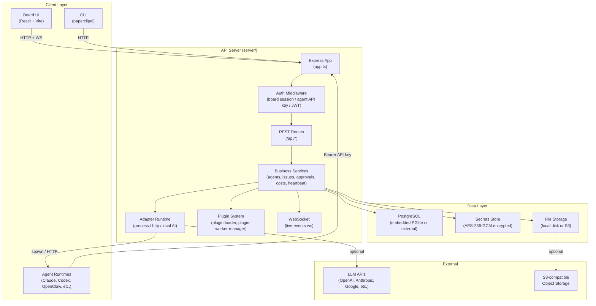
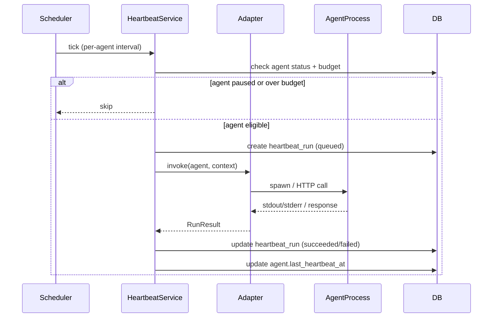
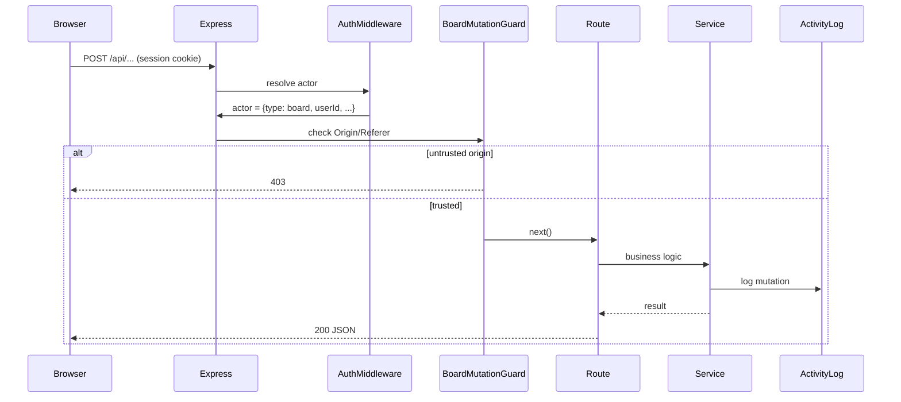

# Paperclip — System Overview

Paperclip is a **control plane for autonomous AI companies**. One instance hosts multiple companies. Each company has an org chart of AI agents, a goal hierarchy, tasks, budgets, and a governance layer (approvals, board oversight).

---

## High-Level Architecture

---

## Package Map

| Package | Path | Purpose |
|---|---|---|
| `server` | `server/` | Express REST API, auth, orchestration services, adapters |
| `ui` | `ui/` | React + Vite board operator interface |
| `db` | `packages/db/` | Drizzle ORM schema, migrations, DB client factory |
| `shared` | `packages/shared/` | Shared types, validators, API path constants |
| `adapter-utils` | `packages/adapter-utils/` | Process spawning, env handling, skill sync utilities |
| `adapters/*` | `packages/adapters/` | Specific adapter implementations (claude, codex, gemini, etc.) |
| `plugin-sdk` | `packages/plugins/sdk/` | Plugin authoring SDK |
| `cli` | `cli/` | Setup, config, doctor, worktree, client commands |

---

## Deployment Modes

| Mode | Exposure | Auth | Use Case |
|---|---|---|---|
| `local_trusted` | loopback only | None (implicit board) | Single-operator local dev |
| `authenticated` | `private` | Session login | Private network (Tailscale/VPN) |
| `authenticated` | `public` | Session login | Internet-facing cloud deployment |

See `doc/DEPLOYMENT-MODES.md` for full details.

---

## Data Flow: Agent Heartbeat Invocation

---

## Data Flow: Board Mutation (Authenticated Mode)

---

## Key Invariants

1. Every entity belongs to exactly one company — enforced at route/service layer.
2. Agent API keys are scoped to one agent + one company — cross-company access returns 403.
3. Task checkout is atomic — single SQL `UPDATE ... WHERE status IN (?) AND assignee IS NULL`.
4. Budget hard-stop — at 100% monthly spend, agent is auto-paused and new invocations are blocked.
5. All mutations write to `activity_log` — immutable audit trail.
6. Secrets are never stored in plaintext — AES-256-GCM at rest, redacted in logs and API responses.
7. API keys are stored as SHA-256 hashes only — plaintext shown once at creation.
