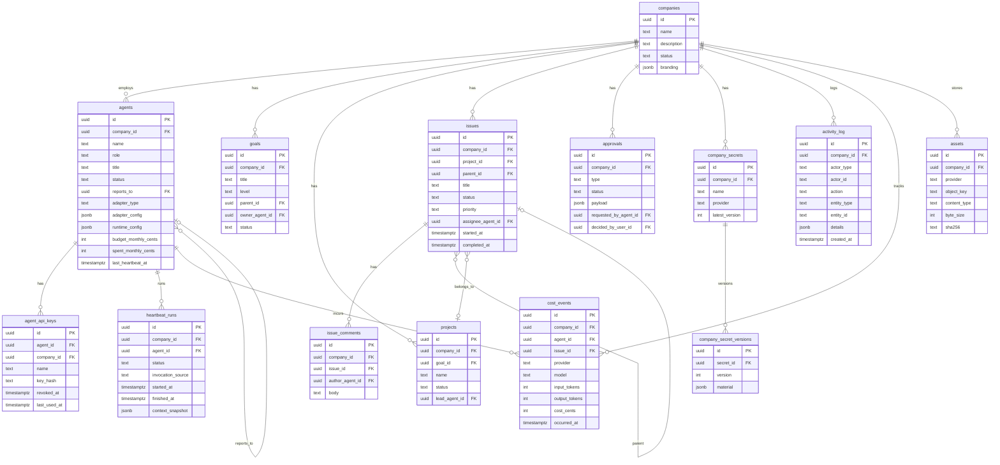
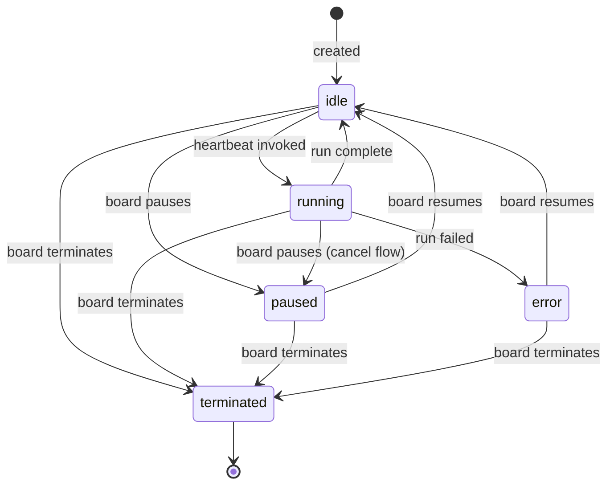
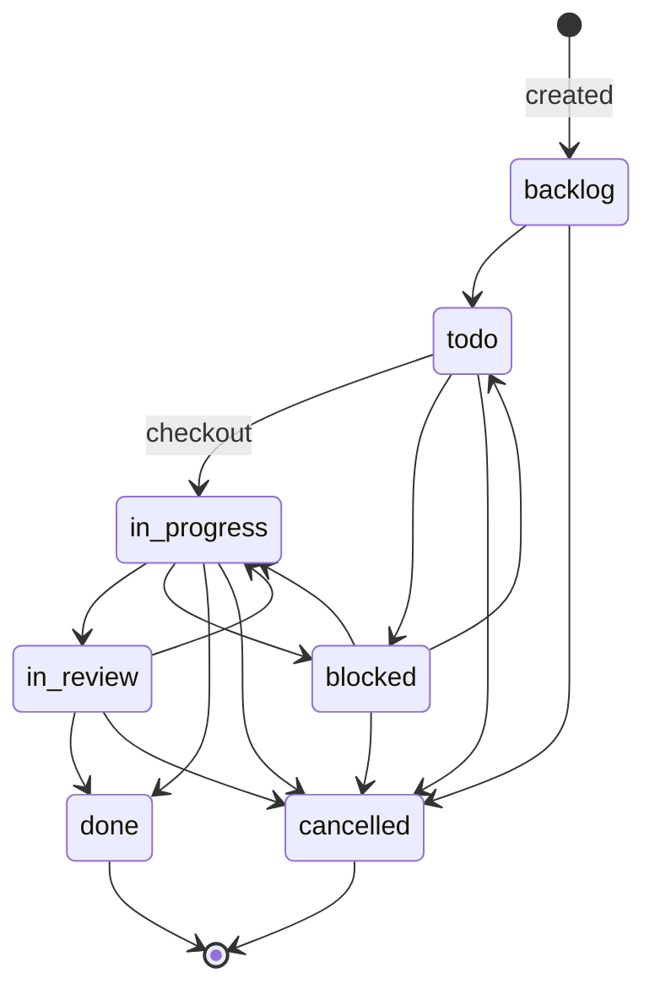
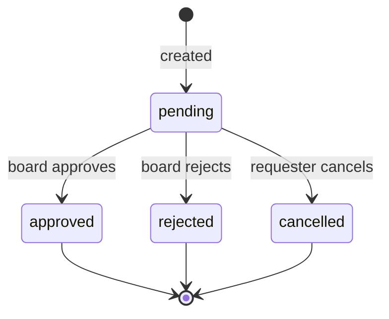

# Paperclip — Data Model

All tables live in PostgreSQL (embedded or external). Schema is managed by Drizzle ORM in `packages/db/src/schema/`.

---

## Entity Relationship Diagram

---

## Auth Tables (managed by better-auth)

| Table | Purpose |
|---|---|
| `auth_users` | Human user accounts |
| `auth_sessions` | Active login sessions |
| `auth_accounts` | OAuth provider links |
| `auth_verifications` | Email verification tokens |
| `board_api_keys` | Long-lived board API keys (hashed) |
| `cli_auth_challenges` | CLI device-auth flow challenges |
| `instance_user_roles` | Instance-admin role grants |
| `company_memberships` | User ↔ company access grants |

---

## Status State Machines

### Agent Status

### Issue Status

### Approval Status

---

## Security Properties of the Data Model

- `agent_api_keys.key_hash` — SHA-256 hash only; plaintext never persisted after creation
- `board_api_keys.key_hash` — SHA-256 hash only; timing-safe comparison on lookup
- `company_secret_versions.material` — AES-256-GCM ciphertext; master key never in DB
- `agents.adapter_config` — may contain secret refs (`{type: "secret_ref", secretId}`); plain values are redacted in API responses and logs
- `activity_log.details` — event payloads are sanitized through `redactEventPayload()` before write
