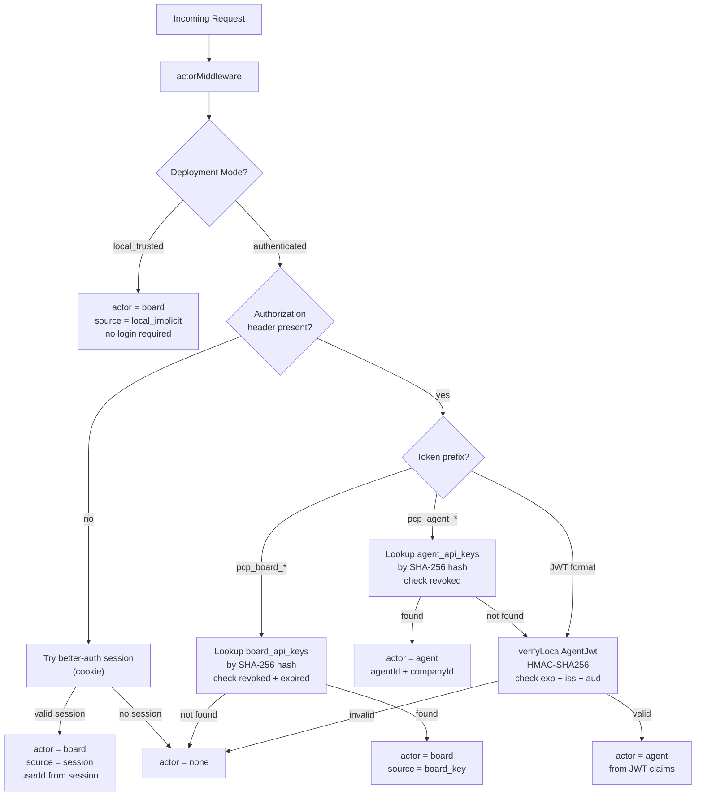
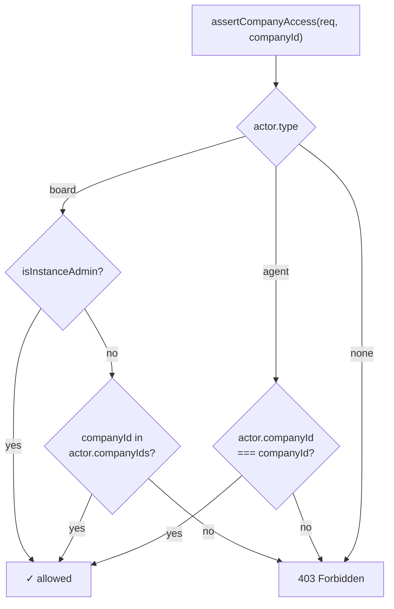
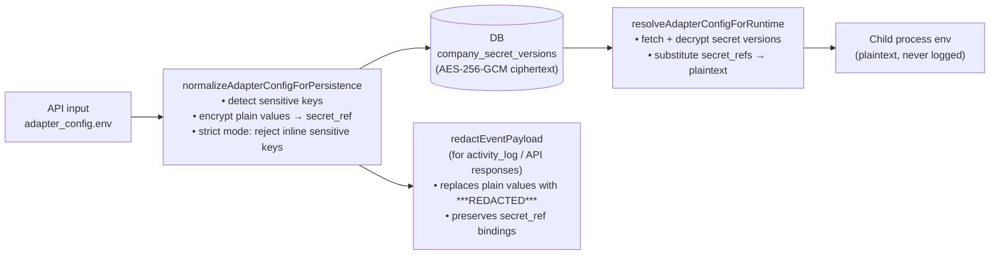
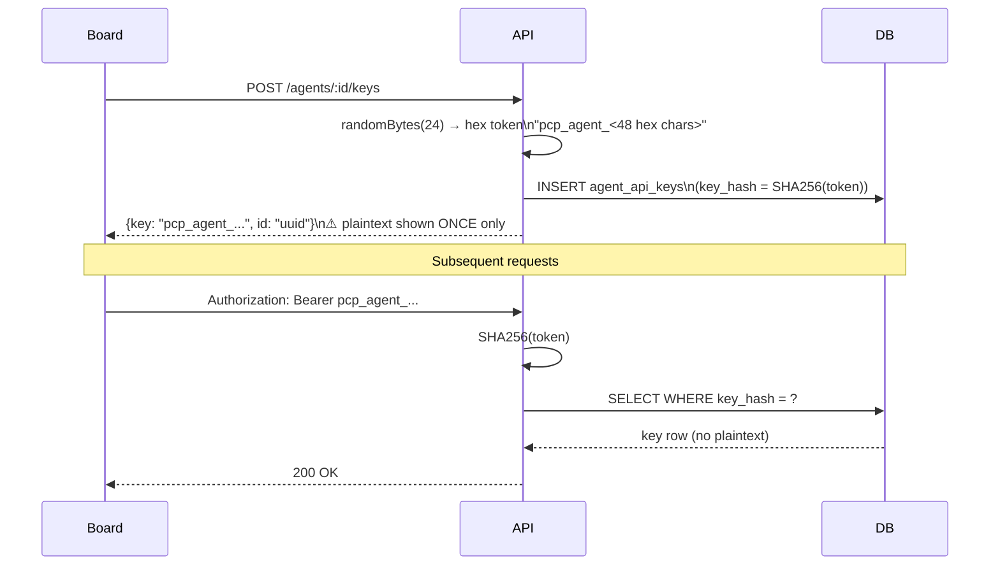

# Paperclip — Auth & Security

---

## Authentication Layers

---

## Authorization Checks

Every route that touches company-scoped data calls `assertCompanyAccess(req, companyId)`:

Board mutations additionally pass through `boardMutationGuard` which validates `Origin` / `Referer` headers to prevent CSRF when the actor source is `session`.

---

## Secret Handling Pipeline

### Encryption Details

- Algorithm: AES-256-GCM
- Key: 32-byte master key (auto-generated on first run, stored at `~/.paperclip/instances/default/secrets/master.key`)
- Per-secret: random 12-byte IV, 16-byte GCM auth tag
- Key override: `PAPERCLIP_SECRETS_MASTER_KEY` env var (base64 / hex / raw 32-char)

---

## API Key Lifecycle

---

## CSRF Protection

`boardMutationGuard` middleware runs on all non-GET/HEAD/OPTIONS requests where `actor.source === "session"`:

- Checks `Origin` header matches `http(s)://<host>` of the request
- Falls back to `Referer` header if `Origin` absent
- Allows `local_implicit` and `board_key` sources through without check (not browser sessions)
- Returns `403` with `"Board mutation requires trusted browser origin"` on mismatch

---

## Log Redaction

Two layers of redaction prevent data leakage in logs:

1. **`redactEventPayload`** (`server/src/redaction.ts`) — applied to `activity_log.details` and API responses for agent configs. Redacts any key matching `api_key`, `token`, `secret`, `password`, `authorization`, `bearer`, `jwt`, `private_key`, `cookie`, `connectionstring`. Also redacts string values that look like JWTs.

2. **`redactCurrentUserValue`** (`server/src/log-redaction.ts`) — masks OS username and home directory paths in log output. Handles `USER`, `LOGNAME`, `USERNAME`, `USERPROFILE`, `HOME` env vars and `os.userInfo()`. Includes Windows paths (`C:\Users\<name>`).

---

## Security Checklist for New Endpoints

When adding a new route:

- [ ] Call `assertCompanyAccess(req, companyId)` for any company-scoped resource
- [ ] Call `assertBoard(req)` for board-only operations
- [ ] Pass `adapter_config` through `redactEventPayload()` before logging or returning in list responses
- [ ] Write to `activity_log` for all mutating actions
- [ ] Return `401` for unauthenticated, `403` for unauthorized (not `404` to avoid enumeration)
- [ ] Validate input with a Zod schema via `validate()` middleware
- [ ] Never return raw secret values — only metadata (`name`, `provider`, `latestVersion`)

---

## Known Security Boundaries

| Boundary | Enforcement |
|---|---|
| Cross-company data access | `assertCompanyAccess` on every route |
| Agent accessing other company | `actor.companyId !== companyId` → 403 |
| Agent key revocation | `revokedAt IS NULL` check on every lookup |
| Board key expiry | `expiresAt > NOW()` check on every lookup |
| JWT expiry | `exp` claim validated in `verifyLocalAgentJwt` |
| Secrets in logs | `redactEnvForLogs` in adapter utils, `redactEventPayload` in routes |
| Secrets in API responses | `redactEventPayload` applied to `adapter_config` in agent list/get |
| File traversal in plugin UI | `realpathSync` containment check in `plugin-ui-static.ts` |
| CSRF for board sessions | `boardMutationGuard` Origin/Referer validation |
