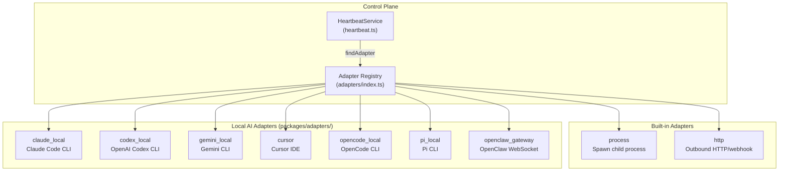
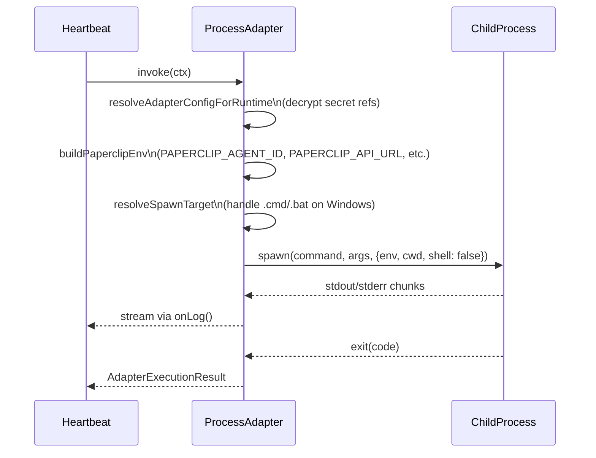
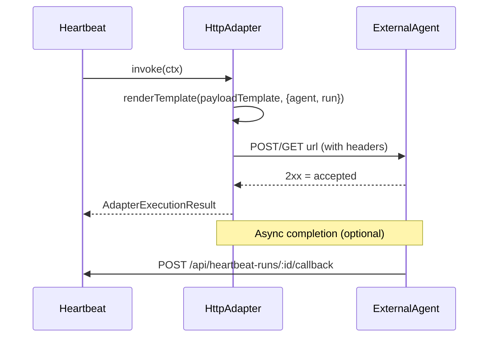
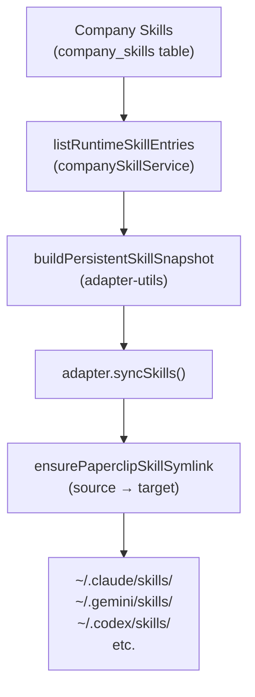

# Paperclip — Adapter System

Adapters are the bridge between Paperclip's control plane and the actual agent runtimes. Each agent has an `adapter_type` and `adapter_config` that determines how its heartbeat is invoked.

---

## Adapter Architecture



---

## Adapter Interface

Every adapter must implement:

```typescript
interface AgentAdapter {
  // Required: start a run
  invoke(ctx: AdapterExecutionContext): Promise<AdapterExecutionResult>;

  // Optional: check run status (for async/HTTP adapters)
  status?(run: HeartbeatRun): Promise<RunStatus>;

  // Optional: cancel a running invocation
  cancel?(run: HeartbeatRun): Promise<void>;

  // Optional: test environment before first run
  testEnvironment?(ctx: TestEnvironmentContext): Promise<TestEnvironmentResult>;

  // Optional: list installed skills
  listSkills?(ctx: SkillContext): Promise<AgentSkillSnapshot>;

  // Optional: sync desired skills
  syncSkills?(ctx: SkillContext, desiredSkills: string[]): Promise<AgentSkillSnapshot>;
}
```

---

## Process Adapter

Spawns a child process and streams stdout/stderr to the run log.



**Config shape:**
```json
{
  "command": "node",
  "args": ["agent.js"],
  "cwd": "/path/to/workspace",
  "env": {"MY_KEY": {"type": "secret_ref", "secretId": "uuid"}},
  "timeoutSec": 900,
  "graceSec": 15
}
```

**Cancel behavior:** `SIGTERM` → wait `graceSec` → `SIGKILL`. On Windows, Node.js maps these to `TerminateProcess`.

---

## HTTP Adapter

Fires an outbound HTTP request to an externally-running agent.



**Config shape:**
```json
{
  "url": "https://my-agent.example.com/wake",
  "method": "POST",
  "headers": {"Authorization": "Bearer {{agent.apiKey}}"},
  "timeoutMs": 15000,
  "payloadTemplate": {"agentId": "{{agent.id}}", "runId": "{{run.id}}"}
}
```

---

## Environment Variables Injected into Every Process Run

`buildPaperclipEnv()` always injects:

| Variable | Value |
|---|---|
| `PAPERCLIP_AGENT_ID` | Agent UUID |
| `PAPERCLIP_COMPANY_ID` | Company UUID |
| `PAPERCLIP_API_URL` | Base URL of the Paperclip API |

The agent uses these to call back into the API with its own API key.

---

## Skill Sync System

Local AI adapters (claude, codex, gemini, etc.) support "skills" — markdown instruction files that are injected into the agent's working environment via symlinks.



Skills are symlinked from the Paperclip repo's `skills/` directory into the adapter's native skills home. On Windows, this requires Developer Mode or admin rights.

---

## Security: Adapter Config Handling

1. **At persistence time** — `normalizeAdapterConfigForPersistence()` detects sensitive env keys and encrypts them as `secret_ref` bindings. In strict mode, inline sensitive values are rejected.

2. **At runtime** — `resolveAdapterConfigForRuntime()` decrypts `secret_ref` bindings back to plaintext for the child process env. Plaintext is never logged.

3. **In API responses** — `redactEventPayload()` replaces plain values with `***REDACTED***` and preserves `secret_ref` bindings as-is.

4. **Claude Code nesting guard** — `CLAUDECODE`, `CLAUDE_CODE_ENTRYPOINT`, `CLAUDE_CODE_SESSION`, `CLAUDE_CODE_PARENT_SESSION` are stripped from the child process env to prevent Claude Code refusing to start inside another Claude Code session.
